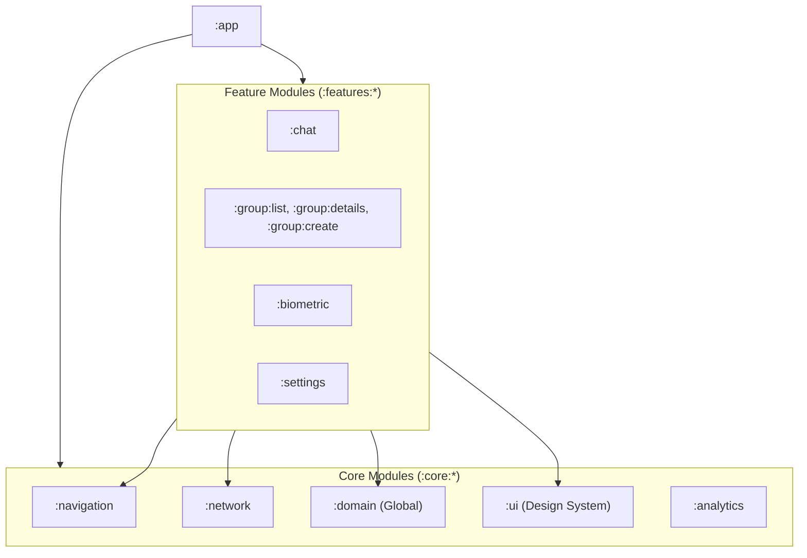
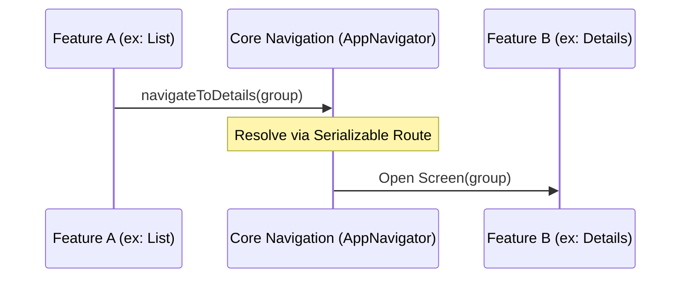

# Documentação de Arquitetura

## Visão Geral

O Friends Secrets utiliza uma **Arquitetura Multi-Módulo Baseada em Features**, fundamentada nos princípios da **Clean Architecture** e no padrão **MVVM/MVI**. Esta estrutura visa o desacoplamento total entre as funcionalidades e a facilidade de testes automatizados.

## Grafo de Módulos (Visual)



## Fluxo de Navegação Desacoplado

A comunicação entre features é feita via **Interfaces de Navegação** no módulo `:core:navigation`. Nenhuma feature depende diretamente de outra.



## Camada de Dados e Abstração

Para proteger o domínio de detalhes de implementação do Firebase, utilizamos o padrão de **Network Service Abstraction**:

1.  **NetworkService**: Uma interface genérica no módulo `:core:network` que gerencia requisições assíncronas.
2.  **Firebase Implementation**: O Firestore é encapsulado como um "provider" de rede, permitindo que a troca para uma API REST seja transparente para os repositórios.
3.  **Mappers**: DTOs (Data Transfer Objects) são convertidos em Entidades de Domínio estritamente na camada de dados.

### MVVM (Model-View-ViewModel)

O padrão MVVM é utilizado na camada de apresentação para separar a lógica de apresentação da interface do usuário. Isso facilita a testabilidade e permite uma melhor separação de responsabilidades.

## Estrutura de Camadas

### 1. Camada de Apresentação (Presentation Layer)

A camada de apresentação é responsável pela interface do usuário e pela lógica de apresentação.

#### Componentes:

- **Views**: Implementadas usando Jetpack Compose, são responsáveis por exibir os dados ao usuário e capturar interações.
- **ViewModels**: Mantêm o estado da UI e processam eventos do usuário, comunicando-se com a camada de domínio.
- **UI Components**: Componentes reutilizáveis da interface do usuário.

#### Fluxo de Dados:

1. A View observa o estado do ViewModel
2. O usuário interage com a View
3. A View notifica o ViewModel sobre a interação
4. O ViewModel processa a interação e atualiza seu estado
5. A View reage às mudanças de estado e se atualiza

### 2. Camada de Domínio (Domain Layer)

A camada de domínio contém a lógica de negócios da aplicação e é independente de frameworks externos.

#### Componentes:

- **Entidades**: Representam os objetos de negócio da aplicação.
- **Casos de Uso (Use Cases)**: Encapsulam operações específicas de negócio que podem ser executadas na aplicação.
- **Repositórios (Interfaces)**: Definem contratos para acesso a dados, sem especificar implementações.

#### Características:

- Não depende de nenhuma outra camada
- Contém regras de negócio puras
- Não tem conhecimento sobre a origem dos dados
- Não contém código relacionado a UI

### 3. Camada de Dados (Data Layer)

A camada de dados é responsável por fornecer dados para a aplicação, abstraindo suas fontes.

#### Componentes:

- **Repositórios (Implementações)**: Implementam as interfaces definidas na camada de domínio.
- **Fontes de Dados**: Podem ser remotas (Firebase) ou locais (banco de dados, preferências).
- **Modelos de Dados**: Representações dos dados para persistência ou comunicação com APIs.

#### Características:

- Implementa interfaces definidas na camada de domínio
- Gerencia múltiplas fontes de dados
- Converte dados entre formatos internos e externos
- Lida com detalhes de persistência e comunicação de rede

## Fluxo de Dados

O fluxo de dados no Friends Secrets segue um padrão unidirecional:

1. **UI (View)** → Captura interações do usuário e as envia para o ViewModel
2. **ViewModel** → Processa eventos e chama casos de uso apropriados
3. **Use Cases** → Executam lógica de negócios e chamam repositórios
4. **Repositories** → Acessam fontes de dados e retornam resultados
5. **ViewModel** → Atualiza o estado com base nos resultados
6. **UI (View)** → Reflete o novo estado para o usuário

## Injeção de Dependência

O Friends Secrets utiliza **Dagger Hilt** para gerenciar a injeção de dependência. Isso facilita a testabilidade, a modularidade do código e automatiza o gerenciamento de escopos de componentes Android.

### Princípios:

- **Escopo por Feature**: Cada módulo de feature define seus próprios módulos Hilt para prover dependências locais (Repositories, UseCases).
- **Injeção de Construtor**: Componentes não instanciam suas dependências diretamente; elas são injetadas no construtor.
- **Interfaces e Abstrações**: Interfaces são usadas para desacoplar a camada de domínio das implementações na camada de dados.
- **Single Source of Truth**: Instâncias de serviços globais (como Firebase) são providas em escopo de Singleton nos módulos `:core`.

## Gerenciamento de Estado

O gerenciamento de estado na UI é feito através de estados imutáveis expostos pelos ViewModels como `StateFlow`. Isso proporciona uma fonte única de verdade para a UI e facilita o rastreamento de mudanças.

### Padrão de Estado:

```kotlin
data class UiState<T>(
    val isLoading: Boolean = false,
    val data: T? = null,
    val error: Throwable? = null
)
```

## Tratamento de Erros

O tratamento de erros segue um padrão consistente em toda a aplicação:

1. **Camada de Dados**: Erros são capturados e convertidos em exceções específicas do domínio
2. **Camada de Domínio**: Exceções são propagadas ou tratadas conforme a lógica de negócios
3. **Camada de Apresentação**: Erros são convertidos em estados de UI apropriados

## Comunicação com Firebase

O Firebase é a principal fonte de dados remota do aplicativo, utilizado para:

- **Firestore**: Armazenamento de dados estruturados
- **Authentication**: Autenticação de usuários
- **Remote Config**: Configurações remotas e feature flags
- **Crashlytics**: Monitoramento de erros
- **Analytics**: Análise de uso

### Padrão de Acesso:

```
View → ViewModel → UseCase → Repository → FirebaseService
```

## Testes

A arquitetura foi projetada para facilitar diferentes tipos de testes:

### Testes Unitários:
- **ViewModels**: Testados com dependências simuladas (mocked)
- **Use Cases**: Testados com repositórios simulados
- **Repositories**: Testados com fontes de dados simuladas

### Testes de Integração:
- Testam a interação entre componentes reais

### Testes de UI:
- Testam a interface do usuário usando Espresso e Compose Testing

## Estrutura Modular e Navegação

O projeto utiliza um sistema de **Navegação Modular Desacoplada** baseada em:

1.  **Feature Initializers**: Cada módulo de feature implementa uma interface `FeatureInitializer` que registra suas próprias rotas no grafo de navegação.
2.  **AppNavigator**: Centraliza as intenções de navegação, permitindo que uma feature navegue para outra sem depender do módulo concreto da mesma.
3.  **Type-Safety**: As rotas são definidas como classes `@Serializable` (Kotlin Serialization), garantindo segurança de tipos na passagem de argumentos complexos (como `GroupModel`).

## Camada de Dados e Abstração de Rede

Para evitar o acoplamento direto com o Firebase, o projeto utiliza um **NetworkService** genérico:

- **Abstração**: Repositórios interagem com o `NetworkService` usando objetos `NetworkRequest` (endpoints e queries).
- **Flexibilidade**: Esta camada abstrai a implementação subjacente do Firestore, facilitando a transição para uma API REST convencional se necessário.
- **DTOs**: O mapeamento entre modelos de dados remotos e entidades de domínio é feito rigorosamente na camada de dados.

### Diagrama de Fluxo de Autenticação

```
┌──────────┐     ┌───────────┐     ┌───────────────┐     ┌──────────────┐
│   Login  │────►│ ViewModel │────►│ AuthUseCase   │────►│ AuthRepository│
│   View   │     │           │     │               │     │               │
└──────────┘     └─────┬─────┘     └───────┬───────┘     └───────┬──────┘
                       │                   │                     │
                       │                   │                     │
                       │                   │                     ▼
                       │                   │             ┌──────────────┐
                       │                   │             │ Firebase     │
                       │                   │             │ Authentication│
                       │                   │             └───────┬──────┘
                       │                   │                     │
                       │                   ▼                     │
                       │           ┌───────────────┐            │
                       │           │ Success/Error │◄───────────┘
                       │           └───────┬───────┘
                       ▼                   │
                 ┌───────────┐             │
                 │ UI State  │◄────────────┘
                 └───────────┘
```

## Considerações de Desempenho

Para garantir um bom desempenho, a arquitetura implementa:

- **Lazy Loading**: Carregamento sob demanda de dados
- **Caching**: Armazenamento em cache de dados frequentemente acessados
- **Coroutines**: Para operações assíncronas eficientes
- **Paginação**: Para conjuntos de dados grandes

## Segurança

A arquitetura implementa várias medidas de segurança:

- **Autenticação**: Gerenciada pelo Firebase Authentication
- **Autorização**: Regras de segurança do Firestore
- **Criptografia**: Dados sensíveis são criptografados
- **Validação**: Entrada do usuário é validada em múltiplas camadas

## Conclusão

A arquitetura do Friends Secrets foi projetada para ser:

- **Modular**: Componentes podem ser desenvolvidos e testados independentemente
- **Testável**: Facilita a escrita de testes unitários e de integração
- **Escalável**: Novas funcionalidades podem ser adicionadas com facilidade
- **Manutenível**: Código organizado e com responsabilidades bem definidas

Esta abordagem arquitetural permite que o aplicativo evolua de forma sustentável, mantendo a qualidade do código e facilitando a colaboração entre desenvolvedores.